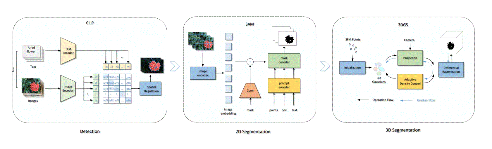

## C-SAGS: A Unified Framework for Text-Driven 2D-3D Segmentation using Informed 3D Gaussian Splatting
<div style="text-align: left">
<br>
</div>
ABSTRACT: In computer vision, 3D segmentation is crucial for scene understanding. This study introduces C-SAGS, a comprehensive framework integrating CLIP, SAM, and 3DGS models for zero-shot, cross-modal 3D segmentation using text and geometric prompts. C-SAGS leverages informed 3D Gaussian Splatting to achieve high-quality 3D scene representation, enabling efficient and accurate segmentation. Experimental results demonstrate improved performance and reduced storage requirements compared to state-of-the-art methods. Our framework supports individual manipulation of segmented objects, facilitating 3D scene editing and reconstruction. We demonstrate a significant enhancement in IoU and accuracy, positioning our work within a broader context of 3D scene comprehension. 

------------------------------------------------------------------------------------------------

<div style="text-align: left">
1. The rendered images with different styles using a single Gaussian pointcloud (Synthetic dataset).
<br>
</div>

<div style="text-align: left">
2. The rendered images with different styles using a single Gaussian pointcloud (LLFF dataset).
<br>
</div>

#### Description
This repository contains the authors implementation associated with the paper [" C-SAGS: A Unified Framework for Text-Driven 2D-3D Segmentation using Informed 3D Gaussian Splatting"](https://gitee.com/liujian-0819/3DGS/blob/master/C-SAGS.pdf)

 _jian liu*, zhen yu_ 

#### Software Architecture
The codes are derived for official code for 3D Gaussian Splatting, please refer to (https://github.com/graphdeco-inria/gaussian-splatting)

#### Hardware Platform:
CPU：Gen Intel(R) Core(TM) i7-13700 2.10 GHz, Memory： 32G, GPU Nvidia A4500 20GB.

#### Installation
platform: Window11, cuda11.8

First you have to make sure that you have all dependencies in place.
The simplest way to do so, is to use [anaconda](https://www.anaconda.com/). 

You can create an anaconda environment called `3DGS` using
```
conda env create -f environment.yml
conda activate 3DGS

``` 


#### Contributions:

1. We developed an integrated framework for 2D-3D segmentation by combining CLIP, SAM, and 3DGS. SAM-CLIP facilitates 2D segmentation for multi-view images based on textual or geometric prompts. Meanwhile, 3DGS is capable of learning a continuous representation of 3D segmentation from the generated 2D masks.

2. We employed an informed Gaussian labeled by object ID to differentiate Gaussian ellipsoids in the splatting process. This enables the independent manipulation of each segmented object, thereby facilitating the process of editing 3D scenes.

3. Different from a typical Gaussian, we integrate multiple spherical harmonic functions associated with style labels into the Gaussian. This integration allows various style scenes to be represented using just one point cloud, considerably decreasing storage needs.

#### Acknowledgments:
This work is supported by the National Supercomputing Center in Zhengzhou.

 Window11, CPU Intel Corei7, RAM 32G, GPU Nvidia A4500 20GB.
>>>>>>> ff9d604 (first time)
